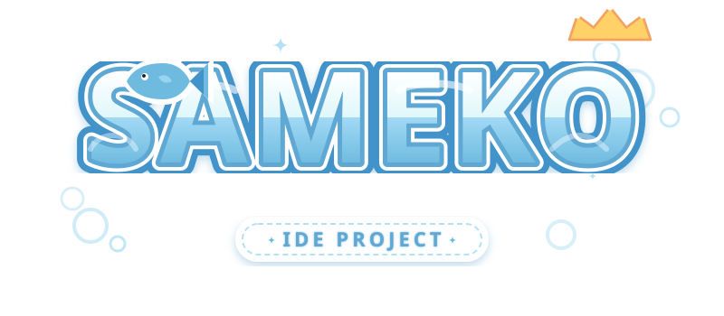
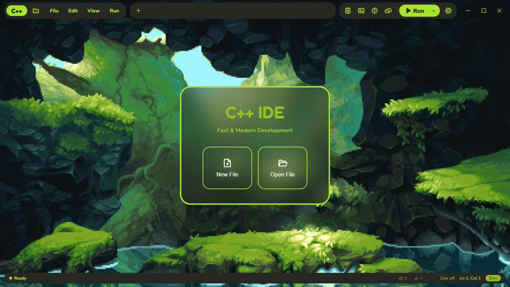
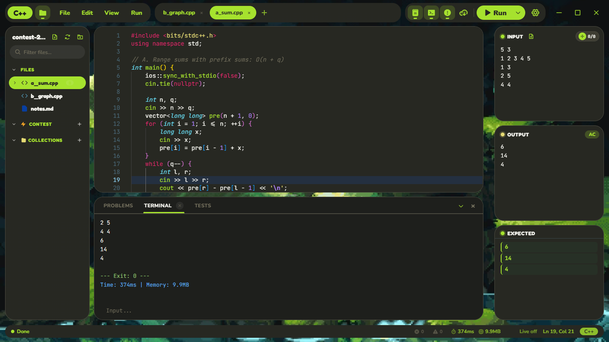
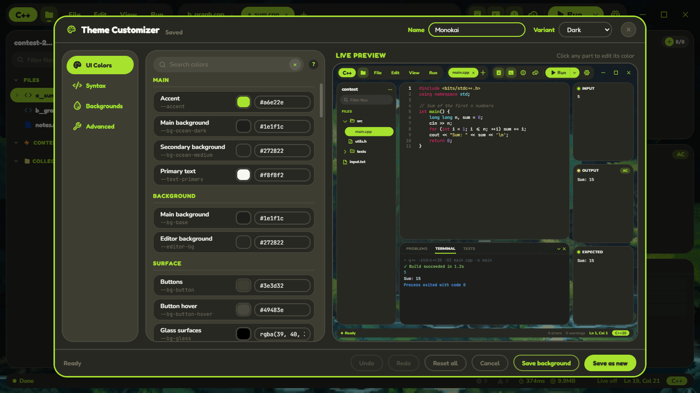
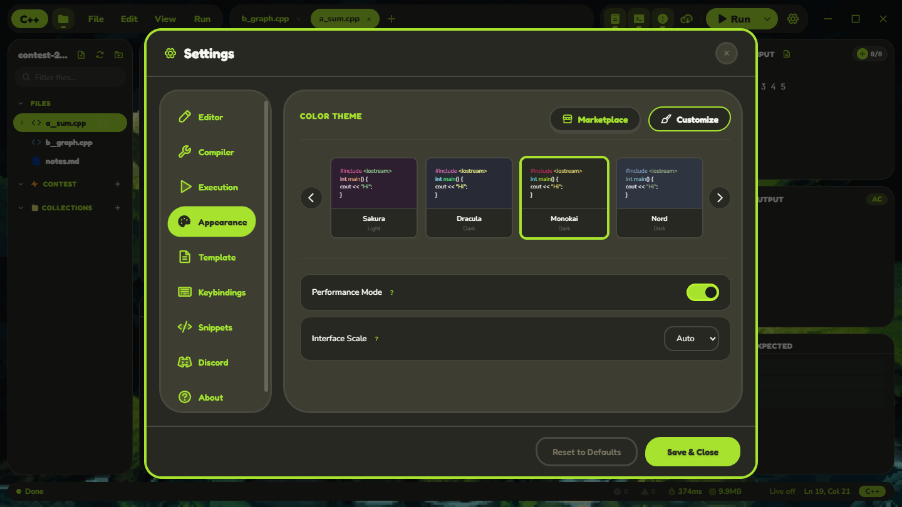

<div align="center">
  <br />
  
  <br />

  # 🐟 Sameko IDE ⚓
  
  **The cutest & fastest C++ IDE for your coding adventures! (≧◡≦) ♡**

  <p>
    <a href="https://sameko.dev/" target="_blank" rel="noopener noreferrer">
      
    </a>
    <a href="https://github.com/QuangquyNguyenvo/Sameko-Dev-CPP/blob/main/LICENSE">
      
    </a>
    <a href="https://github.com/QuangquyNguyenvo/Sameko-Dev-CPP">
      
    </a>
  </p>
</div>

<br />

<div align="center">
  ★ 。＼｜／。★
  <br/>
  <b>Welcome to the deep blue sea of coding! 🌊</b>
  <br/>
  ★ 。／｜＼。★
</div>

<br />

<div align="center">
  
</div>

<br />

<div align="center">
  <p>
    <a href="#-features">Features</a> •
    <a href="#-screenshots">Screenshots</a> •
    <a href="#-download">Download</a> •
    <a href="#-development">Development</a> •
    <a href="#-shortcuts">Shortcuts</a>
  </p>
</div>

<br />

## 🎯 About

<table>
  <tr>
    <td width="70%">
      <p><b>Sameko IDE</b> is a lightweight C++ IDE for Windows and Linux, built for competitive programming and learning. The Windows build comes with GCC 16 pre-configured — no MinGW installation needed. Just download, extract, and start coding.</p>
      <blockquote>💡 Think of it as a modern Dev-C++ alternative: simple interface, fast compilation, works out of the box.</blockquote>
      <p><sub>An unofficial fan project, not affiliated with Sameko Saba. <a href="#-the-story-behind-it">Why the name?</a></sub></p>
    </td>
    <td width="30%" align="center">
      
    </td>
  </tr>
</table>

<br />

## ✨ Features

- 🚀 GCC 16 bundled on Windows, no setup required (on Linux it uses your distro's `g++`)
- ⚡ Press F11 to compile and run instantly; an unchanged file runs again without recompiling
- ✅ Input / Output / Expected cards with an AC / WA verdict, and big test inputs straight from a `.txt` file
- 🐞 Real GDB debugger: breakpoints, watches, STL-aware variable trees, and an **Auto dry run** that walks your program line by line on its own
- 🏆 Fetch test cases from Codeforces, AtCoder, LeetCode via Competitive Companion, and run them all in parallel
- 🔗 Auto-links .cpp files when you `#include` custom headers
- 🎨 6 themes: Kawaii Dark, Kawaii Light, Sakura, Dracula, Monokai, Nord, plus your own in the Theme Customizer
- 📑 Multi-tab editor with split view
- ✂️ Custom snippets and templates (BFS, DFS, Segment Tree, etc.)
- 🧹 Format code with AStyle (`Ctrl+Shift+A`)
- 💾 Auto-save with configurable intervals
- 👁️ File watcher detects external changes

<br />

## 📸 Screenshots

<div align="center">
  
  <br /><br />
  
  
  <br />
  
  
</div>

<br />

## 🆕 What's New in v1.3.1

- **Open with Sameko.** Files opened from Windows Explorer now open in the IDE, even when it is already running.
- **Write-ups and test data.** `.md` is highlighted as Markdown, `.txt` / `.inp` / `.out` open as clean plain text with `# ` comments and `[SECTION]` headers, and C++ tools stay out of their way.
- **A new Theme Customizer.** A live mini copy of the IDE, click-to-edit colors, search, ↺ to undo a single color, and highlighted Theme JSON.
- **Smarter Open / Save.** Ctrl+O starts in the folder you are working in, and text and test files are in the file filters.
- **Polished dialogs** and a Discord preview that looks like the real profile card.
- **Many theme fixes**: Reset, Undo / Redo, backgrounds, import / export and more.

See [CHANGELOG.md](CHANGELOG.md) for the full list.

### Multi-file project note

If your project is split across multiple `.cpp` files and you see linker errors like `undefined reference`, open:

- `Settings > Compiler > Single-file Compile Mode`

Then turn it **OFF** and build again.

## 📥 Download

<div align="center">

<a href="https://sameko.dev/" target="_blank" rel="noopener noreferrer">
  
</a>
<a href="https://github.com/QuangquyNguyenvo/Sameko-Dev-CPP/releases/latest" target="_blank" rel="noopener noreferrer">
  
</a>

</div>

<br />

### 🪟 Windows *(Compiler Bundled)*

> 💡 **Zero setup required.** MinGW-w64 (GCC 16.1.0) is pre-packaged. Download and code!

| Package | Format | Description | Recommendation |
| :--- | :---: | :--- | :--- |
| **Setup** | `sameko-dev-cpp-<version>-installer.exe` | One-window setup: pick a folder and install, with Start Menu shortcuts & auto-update | **⭐ Recommended for most users** |
| **Installer** | `sameko-dev-cpp-setup-<version>.exe` | The classic step-by-step installer (same install, used by auto-update) | If you prefer the wizard |
| **Portable** | `.zip` | Standalone archive. Extract anywhere (including USB drives) and run | Ideal for school / restricted PCs |

<br />

### 🐧 Linux Installation Guide

Sameko on Linux uses your system's compiler and debugger. Follow these 3 simple steps:

#### 📌 Step 1: Install prerequisites (`g++` & `gdb`)

Open your terminal and run the command for your Linux distribution:

```bash
# Debian / Ubuntu / Linux Mint / Pop!_OS
sudo apt update && sudo apt install -y g++ gdb

# Fedora / RHEL
sudo dnf install -y gcc-c++ gdb

# Arch Linux / Manjaro
sudo pacman -S --noconfirm gcc gdb
```

---

#### 📌 Step 2: Download your preferred package

Get the latest Linux release from [**sameko.dev**](https://sameko.dev/) or [**GitHub Releases**](https://github.com/QuangquyNguyenvo/Sameko-Dev-CPP/releases/latest).

---

#### 📌 Step 3: Run or install the application

- 🔹 **Option A: AppImage** *(Universal — no installation needed)*
  ```bash
  chmod +x sameko-dev-cpp-*.AppImage
  ./sameko-dev-cpp-*.AppImage
  ```

- 🔹 **Option B: `.deb` Package** *(Debian / Ubuntu / Mint — auto-configures app menu & sandbox)*
  ```bash
  sudo apt install ./sameko-dev-cpp-*.deb
  sameko-dev-cpp
  ```

- 🔹 **Option C: `.tar.gz` Archive** *(Standalone portable folder)*
  ```bash
  tar -xzf sameko-dev-cpp-*-linux-*.tar.gz
  cd sameko-dev-cpp-*-linux-*
  ./sameko-dev-cpp
  ```

---

<details>
<summary><b>🔍 Linux Troubleshooting Tips (FUSE 2 & Chrome Sandbox)</b></summary>

<br />

- **AppImage fails to open**: Ubuntu 22.04+ may require FUSE 2:
  ```bash
  sudo apt install libfuse2
  ```
  *(Or run with `./sameko-dev-cpp-*.AppImage --appimage-extract-and-run`)*

- **Chrome Sandbox permission error**: If running unpacked `.tar.gz` on Ubuntu 24.04+:
  ```bash
  sudo chown root:root chrome-sandbox && sudo chmod 4755 chrome-sandbox
  ```
  *(The `.deb` installer configures sandbox permissions automatically).*

</details>

<br />

## 🛠️ Development

### Prerequisites
- Node.js v18+
- npm or yarn
- On Linux: `g++` and `gdb` (see [Linux](#linux) above)

### Setup

```bash
# Clone the repository
git clone https://github.com/QuangquyNguyenvo/Sameko-Dev-CPP.git
cd Sameko-Dev-CPP

# Install dependencies
npm install

# Run in development mode
npm start
```

### Building

```bash
npm run build        # the three release artifacts: Windows installer + portable .zip + Linux AppImage
npm run build:win    # Windows only
npm run build:linux  # AppImage + .deb + .tar.gz  (run this on Linux or WSL)
npm run build:all    # everything, in one pass
```

Everything lands in `samekodevcpp/`. A full `npm run build` produces:

| Artifact | Notes |
| :--- | :--- |
| `sameko-dev-cpp-<version>-installer.exe` | Windows setup window, with the NSIS installer inside |
| `sameko-dev-cpp-setup-<version>.exe` | Windows installer (NSIS); the in-app updater uses this one |
| `sameko-dev-cpp-<version>-portable.zip` | Windows portable folder, zipped |
| `sameko-dev-cpp-<version>-linux-x86_64.AppImage` | Linux, runs on any distribution |
| `latest.yml` + `.blockmap` | Update metadata the in-app updater reads |

> **How the AppImage gets built on Windows.** Packing an AppImage requires creating symlinks, which
> Windows only allows from an elevated terminal or with Developer Mode on; otherwise electron-builder
> stops at `A required privilege is not held by the client`. `scripts/build-appimage.js` checks for
> that permission up front and, when it is missing, runs the same build **through WSL** — which has
> no such restriction and can build in place from `/mnt/<drive>`. So `npm run build` produces all
> three artifacts on a plain terminal as long as WSL is installed; if it is not, the script prints
> every way to fix it. The Windows targets are built first either way, so they survive a Linux-side
> failure.
>
> `.deb` additionally needs `fpm`, which has no Windows build — run `npm run build:linux` inside WSL
> or on a real Linux machine for the `.deb` and `.tar.gz`.

### Housekeeping

```bash
npm run clean        # wipe settings/history/snippets (the app's user-data folder)
npm run clean:dist   # wipe samekodevcpp/
npm run rebuild      # clean:dist, then a full build
```

<br />

## ⌨️ Shortcuts

| Key                | Action               |
| :----------------- | :------------------- |
| `F9`               | Compile              |
| `F10`              | Run                  |
| `F11`              | Compile & Run        |
| `Ctrl + N`         | New file             |
| `Ctrl + O`         | Open file            |
| `Ctrl + S`         | Save file            |
| `Ctrl + Shift + S` | Save As              |
| `Ctrl + J`         | Toggle Panel         |
| `Ctrl + \`         | Split Editor         |
| `Ctrl + Shift + A` | Auto Format (AStyle) |
| `Ctrl + Alt + S`   | Toggle Auto-Save     |
| `Ctrl + Shift + P` | Command Palette      |

### While debugging

Click the left gutter to set a breakpoint, then press `F5`. `F10` and `F11` switch to stepping for
as long as the session is live, and go back to Run / Compile & Run once it ends.

| Key               | Action                                        |
| :---------------- | :-------------------------------------------- |
| `F5`              | Start debugging · Continue                    |
| `F10`             | Step over                                     |
| `F11`             | Step into                                     |
| `Shift + F11`     | Step out                                      |
| `Shift + F5`      | Stop debugging                                |
| `Esc`             | Stop an Auto dry run · leave the step history |
| `Alt` + gutter    | Conditional breakpoint                        |
| `Ctrl` + gutter   | Enable / disable a breakpoint                 |
| Right-click a line | Run to Cursor                                |

<br />

## 🤝 Contributing

**💖 Contributors**

- **Yunchan** (Special thanks for designing the logo!)
- **[KingShiba3766](https://github.com/daonghiemminh-collab)** (Donated the `sameko.dev` domain)
- **[aiko-chan-ai](https://github.com/aiko-chan-ai)** (Fixed G++ spawn issue on some machines)
- **[MerlyStella](https://github.com/MerlyStella)** (Tested everything, twice. The app is better because of it :D)

**📝 Want to contribute?**

Contributions are welcome! Please read [CONTRIBUTING.md](CONTRIBUTING.md) before submitting a PR.

<br />

## 🐟 The story behind it

I like making my coding space feel like mine: themes, wallpapers, characters I like. Sameko Saba is one of them.

Classic Dev-C++ can barely be customized. VS Code can, but every time I changed computers (at school, for example) I had to set everything up again: the compiler, extensions, settings, theme. So I made my own IDE, one that comes with its compiler, works as soon as you open it, and lets me change every colour.

To be honest, most of this started because I just wanted to customize things my way. Saba is what kept me motivated while building it, so the app is named after her.

**Not an official project.** Sameko Dev C++ is a free, unofficial fan project. It is not affiliated with or endorsed by Sameko Saba or anyone who represents her. All rights to her name, likeness and artwork belong to their owners. The built-in themes don't use her artwork; I'd love to make a Saba theme one day, but only with permission.

**Art credits.** The Saba illustration on the website is by **[Nuu (@XD_zow)](https://x.com/XD_zow)**. Saba's character design is by Shouu and her illustration by Tousaki Shiina. The logo was designed by Yunchan.

If you own any of this and want something changed or removed, please [open an issue](https://github.com/QuangquyNguyenvo/Sameko-Dev-CPP/issues) and I'll fix it quickly.

<br />

## 📄 License

This project is licensed under the **MIT License** - see the [LICENSE](LICENSE) file for details.

<br />

---

<div align="center">
  <p>Made with 💙 and 🐟 by <a href="https://github.com/QuangquyNguyenvo"><strong>QuangquyNguyenvo</strong></a></p>
  <p><i>"Have a bubbly day!"</i></p>
  <br />
  <p>
    <a href="https://github.com/QuangquyNguyenvo/Sameko-Dev-CPP/issues">Report Bug</a> •
    <a href="https://github.com/QuangquyNguyenvo/Sameko-Dev-CPP/issues">Request Feature</a>
  </p>
</div>


---

<div align="center">
  <sub><strong>Keywords</strong>: C++ IDE • portable C++ compiler • Dev-C++ alternative • competitive programming IDE • beginner-friendly IDE • lightweight IDE • Windows C++ IDE • GCC compiler • Monaco Editor • Electron IDE • code editor • student IDE • educational software • free C++ IDE • C++11 • C++14 • C++17 • C++20 • C++23 • syntax highlighting • auto-completion • Codeforces • AtCoder • LeetCode • programming tools • MinGW • code runner • AStyle formatter</sub>
</div>


